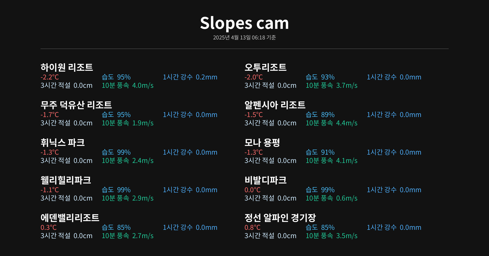

## 전국 스키장 실시간 웹캠 뷰어

* 링크: [http://ski.atik.kr](http://ski.atik.kr)

[](https://github.com/hletrd/slopes/actions/workflows/static.yml)
[](https://github.com/hletrd/slopes/actions/workflows/fetch_weather.yml)
[](https://github.com/hletrd/slopes/actions/workflows/webcam-scraper.yml)



* 전국 스키장의 실시간 웹캠 뷰를 제공합니다.
* 전국 스키장의 실시간 날씨 정보를 제공합니다.
* 본 사이트는 스키장에서 공식적으로 제공하는 서비스가 아니며, 각 스키장의 공식 웹캠 스트림을 중계하여 제공합니다. 스키장의 사정에 따라 웹캠 스트림은 일시적 또는 영구적으로 중단될 수 있습니다.

---

### 지원 스키장 및 웹캠 목록

#### 경기권
<details>
<summary>곤지암리조트</summary>

* 정상 휴게소
* 정상부 슬로프
* 중간 슬로프
* 초중급 베이스
* 중상급 베이스
</details>

<details>
<summary>지산 포레스트 리조트</summary>

* 레몬 탑승장
* 오렌지 / 뉴오렌지 탑승장
* 5번 / 6번 슬로프
* 블루 탑승장
* 실버 탑승장
</details>

<details>
<summary>엘리시안 강촌</summary>

* 유튜브 채널
</details>

#### 강원권
<details>
<summary>비발디파크</summary>

* 슬로프 전경
* 발라드 상단
* 발라드 하단
* 재즈 상단
* 재즈 하단
* 테크노 상단
* 테크노 하단
* 블루스
* 클래식
* 레게
* 펑키 상단
* 펑키 하단
* 힙합
* 스키월드 정상
* 스노위랜드1
* 스노위랜드2
</details>

<details>
<summary>오크밸리</summary>

* 스키광장
* I 슬로프
* G 슬로프
* F 슬로프
* 플라워리프트 하차장
</details>

<details>
<summary>웰리힐리파크</summary>

* 알파
* 베이스
* 브라보
* 정상 광장
* 패밀리
* 워터플래닛
</details>

<details>
<summary>휘닉스파크</summary>

* 호크 / 스패로우
* 도도
* 불새마루
* 베이스
* 펭귄
* 스노우 빌리지
</details>

<details>
<summary>알펜시아 리조트</summary>

* 알펜시아 리조트 라이브캠
</details>

<details>
<summary>모나 용평</summary>

* 발왕산 氣 스카이워크
* 발왕산 천년주목숲길
* 베이스 전경 / 레드 슬로프
* 모나 용평 진입로
* 옐로우 슬로프
* 핑크 슬로프
* 메가그린 슬로포
* 골드 슬로프 전경
* 골드 슬로프 정상
* 레인보우 전경
* 레인보우 파라다이스 입구
* 피크 아일랜드
</details>

<details>
<summary>하이원리조트</summary>

* 하이원탑 (제우스1 입구)
* 하이원탑 (헤라2 입구)
* 하이원탑 (아폴로1 입구)
* 마운틴허브 (스노우월드 입구)
* 마운틴허브 (아폴로3 입구)
* 마운틴허브 (아테나2 입구)
* 마운틴 베이스 (아테나 리프트)
* 아테나2 하단
* 밸리탑 (빅토리아1 입구)
* 제우스2 합류구간
* 밸리허브 (헤라 리프트 입구)
* 밸리허브 (아폴로3 합류)
* 밸리허브 (제우스3)
* 제우스3 중단
* 아폴로4 중단
* 아폴로 베이스
* 제우스3 하단
* 밸리 베이스
</details>

<details>
<summary>오투리조트</summary>

* 스키하우스
* 오렌지
* 버금마루
* 으뜸마루
</details>

#### 전라 및 경상권
<details>
<summary>무주리조트</summary>

* 설천봉 정상
* 설천상단슬로프
* 모차르트, 미뉴에트
* 폴카
* 실크로드, 미뉴에트 하단
* 만선봉 정상
* 하이디하우스
* 서역기행, 썬다운
* 커넥션
* 설천하우스
* 만선하우스
</details>

<details>
<summary>에덴밸리리조트</summary>

* 베이직
* 슬로프 광장
</details>

---

### 로컬에서 돌리는 법

```sh
$ python3 server.py && open http://localhost:3001
```

---

### 앞으로 할 일

#### 기능
* [x] 비발디파크 영상 추가
  * ~~24/25 시즌 종료 후 영상 스트리밍 페이지가 사라져서 확인할 수 없는 상태~~
    * 이거 클라이언트 사이드에서만 막아놓은 거라 알아서 잘 해결함
  * ~~일단 추가해놓긴 했는데 매우 불안정함. 개선 필요.~~
    * 거의 되는 듯? 다만 서버 자체가 불안정한 문제는 있음.
  * ~~비발디파크는 굉장히 특이한 솔루션으로 영상을 스트리밍중이라 조금 답이 없는 상태.~~
  * ~~SDK 자체가 한 페이지에서 여러 영상을 동시 재생하지 못하도록 되어 있음.~~
    * ~~iframe을 쓰면 되긴 하는데 나중에 하는걸로..~~
    * 완료
* [x] 오투리조트 직접 스트리밍 지원
* [ ] 날씨 지도 추가 (구상중)
  * [ ] 특정 지역에 핀을 추가해서 날씨를 확인할 수 있게
* [ ] 날씨 예보 추가
* [x] 스트리밍 데이터 절약을 위해 모바일에서 자동재생 끄기 옵션 추가
* [ ] 리프트 및 슬로프 오픈 정보
  * 이거 어떻게 자동화하지?
  * 일단 링크부터가 리조트마다 맘대로라 자동으로 긁어오기가 쉽지 않을 것 같음. 고민중.
    * 현황 페이지가 아닌 공지사항으로 오픈 정보를 올리는 리조트가 있음...
* [ ] 리조트별 주요 정보 링크
  * [ ] 식당 등 편의시설
  * [ ] 장비 렌탈
  * [ ] 스키 레슨 정보 (보드 레슨은 안 넣어도 됨)
  * [ ] 셔틀 및 교통

#### 성능 개선
* [x] Github Action 퍼포먼스 개선
  * 웹캠 링크 수집이 느려서 자주 업데이트하지 못하고 있음.
  * Self-hosted runner로 바꿔서 해결 완료
* [x] Repo commit 대신 다른 방법으로 데이터 서비스
  * 우선 서버에 파일을 저장하는 방식으로 셋업해놓긴 했는데 기본적인 목표가 stateless한 시스템을 만들자였기 때문에 맘에 들지는 않음.
  * 이럴거면 차라리 DB에 저장하는 게 맞지 않나?
* [ ] HLS relay 셋업
  * 스키장 웹캠을 보는 사람이 늘어날수록 스키장의 트래픽 부하가 늘어날 것이므로 결국에는 본 서비스에서 프록시 서비스를 제공하여 스키장으로 전달되는 부하를 경감시켜 주어야 할 것임.
  * 유튜브 라이브가 아닌 이상 대부분 스키장의 라이브캠은 자체 DVR 서버로 서비스되고 있고, 처리 가능한 트래픽 용량이 크지 않음. 프록시를 도입한다면 스키장 측의 부하를 크게 줄이면서 더 많은 사용자에 대한 scalability를 확보할 수 있을 것으로 보임.
    <details>
      <summary>CDN / 스트리밍 서비스를 쓰는 스키장</summary>

      * 곤지암리조트 (클라우드앤)
      * 엘리시안 강촌 (유튜브)
      * 오크밸리 (KT CDN)
      * 웰리힐리파크 (클라우드앤)
      * 알펜시아 리조트 (유튜브)
      * 모나 용평 (KT CDN)
      * 무주 덕유산 리조트 (클라우드앤)
      * 에덴밸리 (RTSP.ME)
    </details>
    <details>
      <summary>자체 서버를 쓰는 것으로 추측되는 스키장</summary>

      * 지산 포레스트 리조트
      * 비발디파크
      * 웰리힐리파크
      * 휘닉스파크
      * 하이원리조트
      * 오투리조트
    </details>
  * 이건 서비스하면서 정확한 metric을 확보해 보아야 할 듯.
  * HLS relay를 도입하면 모든 연결을 HTTPS로 옮길 수 있다는 장점도 있음.

#### 디자인 개선
* [ ] PWA 레이아웃 수정
  * safe area 밖(홈 버튼)에 footer가 렌더링되는 문제를 인지하고 있음.
* [x] 드롭다운 메뉴 동작 고민
  * 드롭다운을 눌렀을 때 리조트가 바로 열리는 게 맞는지 잘 모르겠음.
  * 일단 토글버튼(⌄)을 눌렀을 땐 리조트 페이지로 이동하지 않도록 해 놓음.

### 급하진 않지만 할 생각은 있는 일
* [ ] 스키장 타임랩스 영상 수집
  * 시간대별 혼잡도 분석을 할 수 있을지 고민 중

* [x] ~~TypeScript / Next.js로 포팅~~
  * 최대한 간단하고 가볍게 만들려고 했는데 이미 일이 너무 커져버림
  * 일단 Next를 쓰는 순간 용량이 꽤 커지기 때문에 페이지 용량이 500kB가 넘기 전까지는 보류 예정

---

### Credits

* [SkiWatch](https://paulkim-xr.github.io/SkiWatch/)와 [ski-resort.kr](https://ski-resort.kr/)의 링크를 참고했습니다.
* Special thanks to: [Claude 3.7 Sonnet](https://www.anthropic.com/claude/sonnet), [GitHub Copilot](https://github.com/features/copilot), [GPT-4o](https://openai.com/index/hello-gpt-4o/)
  * 많은 코드를 작성해 주었습니다.